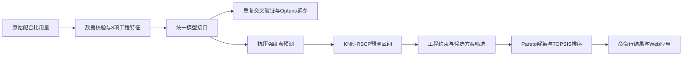

# SCM 混凝土强度机器学习与决策支持

[](https://github.com/Barometer-2002/scm-concrete-strength-ml/actions/workflows/tests.yml)
[](https://www.python.org/)
[](LICENSE)

这是一个面向补充胶凝材料（SCM）混凝土的机器学习工程项目，覆盖配合比数据校验、工程特征构建、统一建模与评估、预测不确定性量化，以及多目标候选方案筛选。仓库同时提供 Python 包、命令行工具、Streamlit 交互应用、单元测试和持续集成。

> **数据声明：**仓库中的 CSV 为程序生成的合成数据，只用于软件测试和界面演示。原研究使用的 1,456 条合并数据涉及多个第三方来源，在逐项确认再分发许可前不会上传。合成数据的运行指标不等于论文结果。

## 已实现功能

| 模块 | 当前公开实现 |
|---|---|
| 数据处理 | 字段检查、数值检查、异常输入拦截、可重复生成的合成样例 |
| 特征工程 | `B`、`W/B`、`A/B`、`SR`、`SP/B`、`FA/B`、`SF/B`、`GGBFS/B` |
| 模型体系 | 随机森林、XGBoost、LightGBM、SVR、MLP 统一接口 |
| 模型评估 | R2、RMSE、MAE、打乱后的重复 K 折交叉验证 |
| 超参数优化 | 可选 Optuna/TPE 搜索，以重复交叉验证平均 RMSE 为目标 |
| 可靠性评估 | 固定宽度保形预测、残差尺度保形预测、KNN-RSCP 自适应区间 |
| 方案决策 | 工程约束筛选、Pareto 非支配解识别、TOPSIS 综合排序 |
| 应用交付 | CLI、中文 Streamlit 应用、测试、代码检查、Python 包构建、GitHub Actions |



## 快速开始

```bash
git clone https://github.com/Barometer-2002/scm-concrete-strength-ml.git
cd scm-concrete-strength-ml
python -m venv .venv

# Windows
.venv\Scripts\activate

# Linux/macOS
source .venv/bin/activate

python -m pip install -e ".[dev]"
python scripts/generate_synthetic_data.py
scm-concrete-ml demo --data data/synthetic_example.csv --output artifacts/demo
pytest
```

端到端示例会生成：

- `artifacts/demo/summary.json`：点预测与区间预测指标；
- `artifacts/demo/predictions.csv`：观测值、预测值及 90% 预测区间。

## 工程特征构建

输入为各组分的体积用量或质量用量，单位必须保持一致：

```python
import pandas as pd
from scm_concrete_ml import engineer_mix_features

raw_mix = pd.DataFrame([{
    "Cement": 300.0,
    "Water": 165.0,
    "Coarse aggregate": 980.0,
    "Fine aggregate": 720.0,
    "FA": 80.0,
    "SF": 20.0,
    "GGBFS": 100.0,
    "SP": 5.0,
}])

X = engineer_mix_features(raw_mix)
print(X)
```

八项特征定义如下：

- `B = Cement + FA + SF + GGBFS`；
- `W/B = Water / B`；
- `A/B = (Coarse aggregate + Fine aggregate) / B`；
- `SR = Fine aggregate / (Coarse aggregate + Fine aggregate)`；
- `SP/B = SP / B`；
- `FA/B = FA / B`；
- `SF/B = SF / B`；
- `GGBFS/B = GGBFS / B`。

## 统一模型比较

```python
from scm_concrete_ml.data import load_dataset
from scm_concrete_ml.models import benchmark_models

X, y = load_dataset("data/synthetic_example.csv")
comparison = benchmark_models(
    X,
    y,
    model_names=("rf", "svr", "mlp"),
    n_splits=5,
    n_repeats=2,
)
print(comparison)
```

安装 `.[boosters]` 可启用 XGBoost 和 LightGBM，安装 `.[tuning]` 可使用 Optuna 调参接口。

## KNN-RSCP 预测区间

```python
from scm_concrete_ml import KNNResidualScaleConformalRegressor, get_model

predictor = KNNResidualScaleConformalRegressor(
    estimator=get_model("rf"),
    alpha=0.1,
    k_neighbors=20,
    random_state=42,
).fit(X, y)

prediction, lower, upper = predictor.predict_interval(X.iloc[:5])
```

该实现使用拟合子集的折外残差训练尺度模型，并将标准化邻域平均距离和邻域强度标准差作为局部信息加入尺度预测。返回区间面向边际覆盖率，不保证每种 SCM 体系、强度范围或材料来源都具有相同覆盖率。

## Pareto 与 TOPSIS 决策

```python
from scm_concrete_ml import Objective, pareto_mask, topsis_score

objectives = [
    Objective("Lower 90", "max"),
    Objective("Carbon score", "min"),
    Objective("Cost score", "min"),
    Objective("SCM replacement", "max"),
]

candidate_table["Pareto"] = pareto_mask(candidate_table, objectives)
pareto = candidate_table.loc[candidate_table["Pareto"]].copy()
pareto["TOPSIS"] = topsis_score(pareto, objectives)
```

成本与碳排放由调用方提供场景系数。仓库不内置所谓通用价格、运输假设或环境产品声明数据，避免把演示参数误认为工程依据。

## 中文 Web 应用

```bash
python -m pip install -e ".[app]"
streamlit run app/streamlit_app.py
```

应用包含三个标签页：

1. **模型概览**：查看合成数据中工程特征与强度的关系；
2. **单组配比预测**：输入各组分用量，获得强度点预测和 90% 预测区间；
3. **候选方案筛选**：设置强度约束、成本系数和碳排系数，查看 Pareto 解集、TOPSIS 排名及交互图表。

应用生成的候选方案与默认场景系数仅用于功能演示，不构成配合比设计建议。

## 原研究结果

原研究基于 1,456 条 SCM 混凝土圆柱体抗压强度记录，对比随机森林、XGBoost、LightGBM、SVR 和 MLP。最终 LightGBM 在冻结测试集上的结果为：

| 指标 | 结果 |
|---|---:|
| R2 | 0.8620 |
| RMSE | 6.6175 MPa |
| MAE | 4.2178 MPa |

在 90% 目标覆盖率下，KNN-RSCP 的经验覆盖率为 `0.9007`，平均区间宽度为 `20.2764 MPa`。这些数值是原研究的历史结果，当前合成数据示例不能复现或证明这些指标。

## 公开边界

当前仓库是对可迁移方法的开源重构，不是论文冻结工作区的逐文件镜像：

- 已公开：特征工程、模型接口、评估、调参、保形区间、Pareto/TOPSIS、Web 应用和测试；
- 未公开：第三方合并数据、训练模型、个人路径、实验归档和论文过程文件；
- 尚未完整迁移：论文专用 SHAP 出图流程、二维响应面脚本和全部冻结超参数；
- 多目标优化与 Web 应用属于研究之后的工程扩展，不冒充论文正式实验结果。

更多信息见[方法说明](docs/methodology.md)、[复现边界](docs/reproducibility.md)和[数据说明](data/README.md)。

## 使用限制

- 文献汇总数据上训练的模型不能自动推广到新的材料来源、养护制度、试件尺寸或试验标准；
- 预测强度、区间宽度和 Pareto 排名只能用于候选方案初筛；
- 实际应用仍需要试验验证、设计规范校核和原材料质量控制；
- 软件许可证与数据许可证相互独立，MIT 许可证不授予任何第三方数据的使用权。

## 仓库结构

```text
src/scm_concrete_ml/   可复用 Python 包
app/                   中文 Streamlit 决策原型
examples/              端到端调用示例
data/                  合成数据与数据说明
docs/                  方法与复现边界
scripts/               合成数据生成脚本
tests/                 单元测试与流程测试
.github/workflows/     持续集成配置
```

## 许可证

代码采用 [MIT 许可证](LICENSE)。第三方数据拥有各自独立的引用与许可要求，本仓库不授予其再分发权利。
