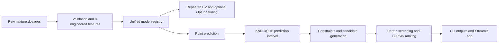

# SCM Concrete Strength ML

[](https://github.com/Barometer-2002/scm-concrete-strength-ml/actions/workflows/tests.yml)
[](https://www.python.org/)
[](LICENSE)

An open, testable implementation of a research workflow for supplementary
cementitious material (SCM) concrete: engineering feature construction, model
comparison, uncertainty-aware strength prediction, and multi-objective
candidate screening.

> The included CSV is synthetic. The 1,456-record study dataset is not
> redistributed because source-by-source redistribution rights have not yet
> been documented. Synthetic-demo metrics are not paper results.

## 中文概览

这个仓库把原论文工作区中可迁移的部分整理成标准 Python 工程，覆盖原始配合比数据校验、8 项工程特征构建、RF/XGBoost/LightGBM/SVR/MLP 统一建模、重复交叉验证、Optuna 调参、KNN 增强残差尺度保形预测，以及约束筛选、Pareto 前沿和 TOPSIS 决策排序。仓库同时提供命令行流程、Streamlit 交互原型、合成样例、单元测试和 GitHub Actions。

公开版强调可运行与可审计，不上传论文目录、第三方合并数据、训练模型、个人路径或实验归档。多目标优化属于论文方法之后的工程扩展，不与已发表或待发表的实验结论混写。

## Capabilities

| Layer | Included behavior |
|---|---|
| Data | Schema validation, numeric checks, deterministic synthetic examples |
| Features | `B`, `W/B`, `A/B`, `SR`, `SP/B`, `FA/B`, `SF/B`, `GGBFS/B` |
| Models | RF, XGBoost, LightGBM, SVR, MLP through one registry |
| Evaluation | R2, RMSE, MAE, shuffled repeated K-fold validation |
| Tuning | Optional Optuna/TPE search using repeated-CV RMSE |
| Reliability | Fixed-width CP, residual-scaled CP, KNN-RSCP intervals |
| Decisions | Constraints, Pareto non-dominated set, TOPSIS ranking |
| Delivery | CLI, Streamlit prototype, tests, linting, package build, CI |



## Quick start

```bash
git clone https://github.com/Barometer-2002/scm-concrete-strength-ml.git
cd scm-concrete-strength-ml
python -m venv .venv
# Windows: .venv\Scripts\activate
# Linux/macOS: source .venv/bin/activate
python -m pip install -e ".[dev]"
python scripts/generate_synthetic_data.py
scm-concrete-ml demo --data data/synthetic_example.csv --output artifacts/demo
pytest
```

The demo writes:

- `artifacts/demo/summary.json`: point and interval metrics;
- `artifacts/demo/predictions.csv`: observed values, predictions, and 90% intervals.

## Python API

### Build engineering features

```python
import pandas as pd
from scm_concrete_ml import engineer_mix_features

raw_mix = pd.DataFrame([{
    "Cement": 300.0,
    "Water": 165.0,
    "Coarse aggregate": 980.0,
    "Fine aggregate": 720.0,
    "FA": 80.0,
    "SF": 20.0,
    "GGBFS": 100.0,
    "SP": 5.0,
}])

X = engineer_mix_features(raw_mix)
```

### Compare models under one protocol

```python
from scm_concrete_ml.data import load_dataset
from scm_concrete_ml.models import benchmark_models

X, y = load_dataset("data/synthetic_example.csv")
comparison = benchmark_models(
    X,
    y,
    model_names=("rf", "svr", "mlp"),
    n_splits=5,
    n_repeats=2,
)
print(comparison)
```

Install `.[boosters]` to add XGBoost and LightGBM, or `.[tuning]` to use the
Optuna tuning API.

### Return an adaptive prediction interval

```python
from scm_concrete_ml import KNNResidualScaleConformalRegressor, get_model

predictor = KNNResidualScaleConformalRegressor(
    estimator=get_model("rf"),
    alpha=0.1,
    k_neighbors=20,
    random_state=42,
).fit(X, y)

prediction, lower, upper = predictor.predict_interval(X.iloc[:5])
```

### Screen candidate solutions

```python
from scm_concrete_ml import Objective, pareto_mask, topsis_score

objectives = [
    Objective("Lower 90", "max"),
    Objective("Carbon score", "min"),
    Objective("Cost score", "min"),
    Objective("SCM replacement", "max"),
]
candidate_table["Pareto"] = pareto_mask(candidate_table, objectives)
pareto = candidate_table.loc[candidate_table["Pareto"]].copy()
pareto["TOPSIS"] = topsis_score(pareto, objectives)
```

Carbon and cost factors must come from the caller. The package intentionally
does not hard-code universal prices, transport assumptions, or EPD values.

## Interactive app

```bash
python -m pip install -e ".[app]"
streamlit run app/streamlit_app.py
```

The app supports single-mixture strength intervals and candidate screening with
editable cost and carbon scenario factors. Its generated candidates and default
factors are demonstrations, not mix-design recommendations.

## Research reference

The original study used 1,456 SCM concrete cylinder-strength records and five
model families. It reported the following held-out results for the selected
LightGBM model:

| Metric | Reported value |
|---|---:|
| R2 | 0.8620 |
| RMSE | 6.6175 MPa |
| MAE | 4.2178 MPa |

At 90% target coverage, the KNN-RSCP experiment reported empirical coverage
`0.9007` and mean interval width `20.2764 MPa`. These are historical research
results and are not asserted by the synthetic public demo. See
[reproducibility notes](docs/reproducibility.md) for the frozen configuration
and [methodology](docs/methodology.md) for implementation details.

## Data and engineering limits

- A model trained on compiled literature data is not automatically valid for a
  new material source, curing regime, specimen geometry, or testing standard.
- Conformal prediction targets marginal coverage under exchangeability; it
  does not ensure equal coverage in every SCM system or strength range.
- Predicted strengths and Pareto rankings are screening evidence, not a design
  code check, laboratory result, or production release decision.
- Third-party datasets should be cited and licensed independently. See
  [data policy](data/README.md).

## Repository layout

```text
src/scm_concrete_ml/   reusable package
app/                   Streamlit decision-support demo
examples/              end-to-end Python example
data/                  synthetic example and data policy
docs/                  methodology and reproducibility boundaries
scripts/               deterministic data generation
tests/                 unit and workflow tests
.github/workflows/     continuous integration
```

## License

Code is released under the [MIT License](LICENSE). Dataset licenses are separate
from the software license; no rights to third-party research data are granted.
